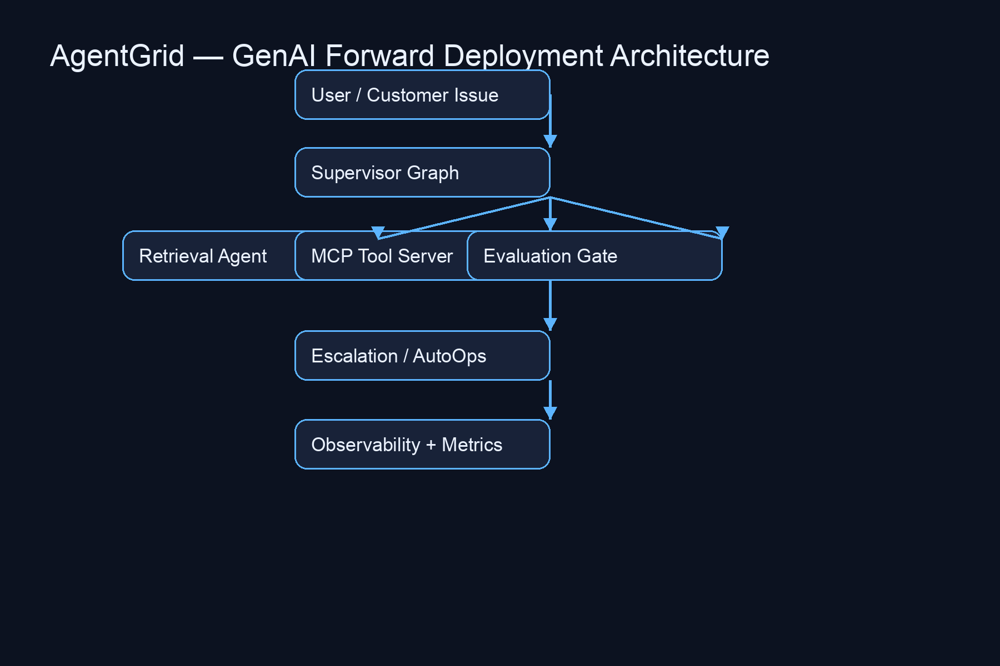
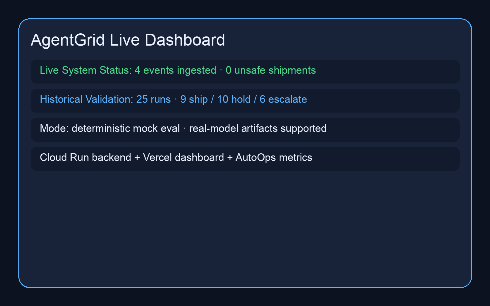
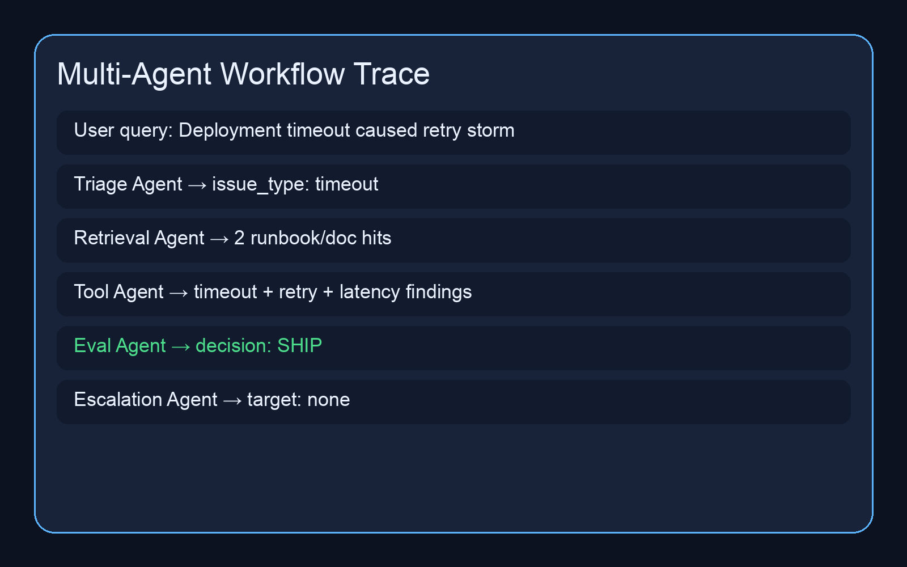
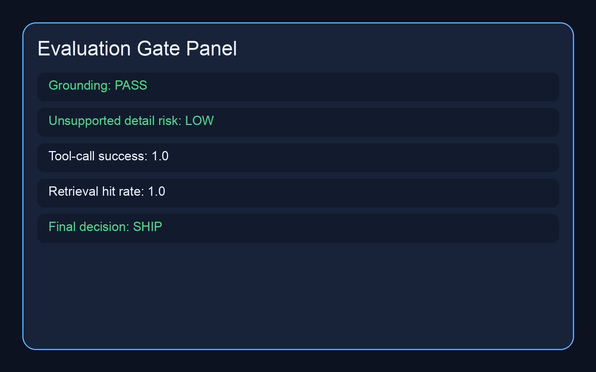
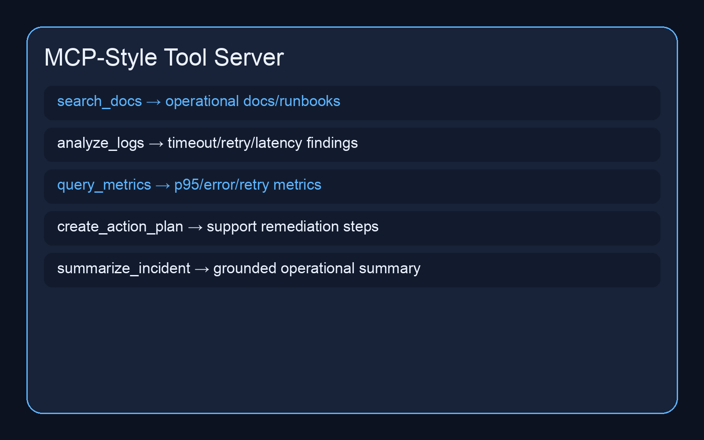
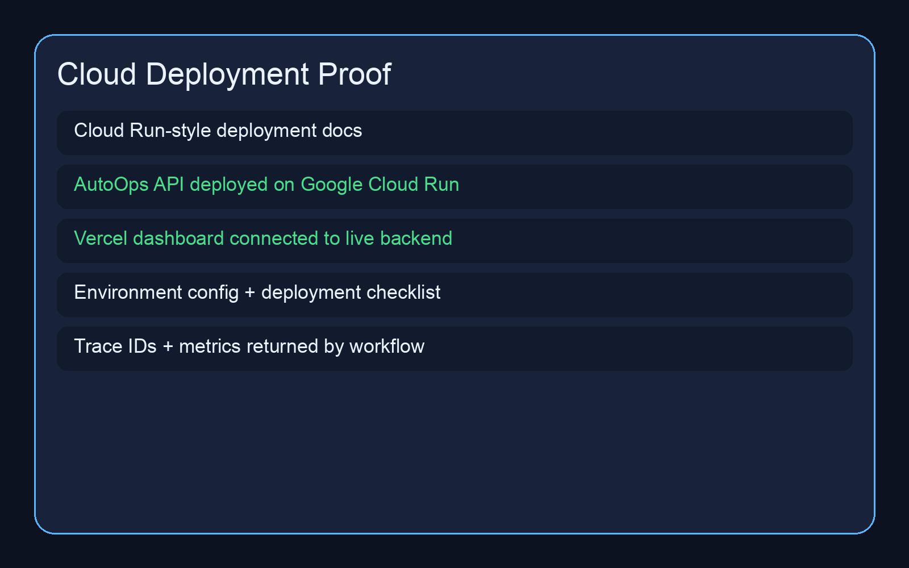
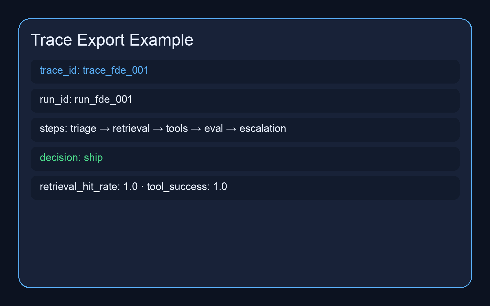
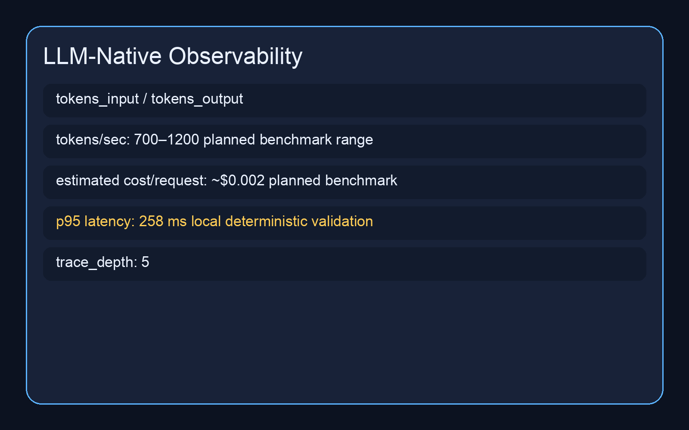

## Live Demo

- https://agentgrid-seven.vercel.app

# AgentGrid — Production-Style GenAI Forward Deployment System

AgentGrid models how production GenAI systems retrieve evidence, orchestrate tools, evaluate outputs, route escalations, and convert unsupported AI behavior into operational decisions.

## Core Features

- Multi-agent orchestration workflows
- MCP-style tool server
- RAG over docs/logs/runbooks
- Evaluation gates (ship / hold / escalate)
- Escalation routing and reviewer workflows
- LLM-native observability
- Cloud deployment workflows
- Customer deployment scenarios
- Trace exports and audit flows
- Support-decision analytics

## System Flow

User query
→ triage agent
→ retrieval agent
→ MCP tool execution
→ answer generation
→ evaluation gate
→ ship / hold / escalate
→ AutoOps incident analytics

## Production Signals

- Cloud Run-style deployment proof
- Redis-backed async validation workflows
- JWT/RBAC reviewer roles
- Prometheus-style metrics
- Trace IDs and audit logs
- Customer deployment case studies
- Multi-agent orchestration
- Operational evaluation gates


```text
Query → RAG → LangGraph → MCP tools → Eval gate → ship/hold/escalate → AutoOps event

AgentGrid is a production-style GenAI support system that uses a LangGraph workflow, retrieval over operational documents/logs/runbooks, MCP-style tools, LLM-native metrics, and an evaluation gate to classify incidents, retrieve evidence, generate action plans, and decide whether to ship, hold, or escalate.

## Why this project exists

Modern support and deployment workflows often fail because operational evidence is scattered across logs, docs, runbooks, and incident notes. AgentGrid turns those inputs into a structured, evidence-backed decision workflow.

## Architecture

```text
Input document/log/runbook
        |
        v
[classify_issue]
        |
        v
[retrieve_context]  ---> local RAG over docs/logs/runbooks
        |
        v
[analyze_logs]      ---> MCP-style tool
        |
        v
[create_action_plan] ---> MCP-style tool
        |
        v
[generate_answer]
        |
        v
[eval_gate]
        |
        v
ship / hold / escalate
What it does
Classifies operational issues from docs, logs, and runbooks
Retrieves supporting evidence with citations
Calls MCP-style tools for document search, log analysis, and action planning
Produces structured JSON outputs
Tracks latency and tool-call success rate
Runs an eval gate for correctness, citation coverage, unsupported answer detection, safety, and final decisioning
Demo

Run one document:

python3 -m src.app --file data/docs/deployment_failure.txt

Run the demo suite:

python3 scripts/run_demo_suite.py

The suite writes metrics to:

reports/demo_metrics.json
Example output
{
  "metrics": {
    "latency_seconds": 0.0028,
    "tool_call_success_rate": 1.0
  },
  "eval_gate": {
    "correctness": true,
    "citation_coverage": true,
    "unsupported_answer": false,
    "safety": true,
    "final_decision": "ship"
  }
}
MCP-style tools

AgentGrid includes three tool-like functions:

search_docs: retrieves evidence from docs, logs, and runbooks
analyze_logs: detects timeout, retry, and latency degradation signals
create_action_plan: generates operational next steps based on the classified issue
Eval gate

The eval gate checks:

correctness
citation coverage
unsupported answer risk
safety
final decision: ship, hold, or escalate
Metrics

AgentGrid tracks:

latency per request
latency p50/p95 across demo suite
tool-call success rate
ship/hold/escalate counts
API

Run locally:

uvicorn src.api.server:app --reload

Health check:

curl http://127.0.0.1:8000/health

Run agent:

curl -X POST "http://127.0.0.1:8000/run?input=DB%20timeout%20failure"
Resume summary

Built a production-style GenAI support and deployment system using LangGraph with RAG over documents, logs, and runbooks, MCP-style tools for retrieval/log analysis/action planning, observability metrics, and an eval gate for correctness, citation coverage, hallucination risk, safety, and ship/hold/escalate decisions.

## Updated Architecture

```text
Query
  |
  v
RAG over docs/logs/runbooks
  |
  v
LangGraph workflow
  |
  v
MCP-style tools
  |
  v
Eval gate
  |
  v
Decision: ship / hold / escalate
  |
  v
AutoOps event emission
API demo

Run the API:

uvicorn src.api.server:app --reload

Request:

curl -s -X POST http://127.0.0.1:8000/agent/run \
  -H "Content-Type: application/json" \
  -d '{"input":"Deployment failed because DB timeout caused retry storm and latency spike."}' \
  | python3 -m json.tool

The response includes:

agent_output
metrics
eval_gate
autoops_event
Real Gemini mode

Mock mode is the default.

To run with Gemini:

export USE_REAL_MODEL=true
export GEMINI_API_KEY="your_key_here"
python3 scripts/run_real_gemini_cases.py

Outputs are saved under:

reports/real_model_runs/


Proof artifacts

Mock mixed batch:

python3 scripts/run_mixed_batch.py --n 25

Output:

reports/mixed_batch/mock_summary.json

Real Gemini runs:

export USE_REAL_MODEL=true
export GEMINI_API_KEY="your_key_here"
python3 scripts/run_real_gemini_cases.py --n 7

Outputs:

reports/real_model_runs/

API demo response:

reports/api_demo/tool_failure_api_response.json


---

## Google Gemini Support Case Study

AgentGrid is also documented as a GenAI support-gating system for product support, support engineering, and AI reliability workflows.

**Live demo:** https://agentgrid-seven.vercel.app/

### Before

A GenAI app could return an answer even when:

- retrieval context was missing
- evidence conflicted across sources
- tool calls failed
- latency exceeded the support budget
- the generated answer was unsupported

### After

AgentGrid evaluates each run and returns one of three decisions:

- `ship` — answer is supported and safe to return
- `hold` — context, latency, or confidence is insufficient
- `escalate` — evidence conflicts or a tool failure requires review

Unsafe or uncertain cases are routed into AutoOps for support review, root-cause analysis, and engineering follow-up.

### Support-validation proof

| Metric | Value |
|---|---:|
| Validation runs | 25 |
| Ship decisions | 9 |
| Hold decisions | 10 |
| Escalate decisions | 6 |
| Unsafe outputs | 0 |
| p95 latency | 258 ms |
| Tool-call success rate | 0.88 |
| AutoOps support-validation incidents | 102 |
| Escalations | 51 |
| Sources | 5 |
| Issue families | 6 |

### Architecture

```mermaid
flowchart TD
    A[User query] --> B[AgentGrid RAG over docs, logs, runbooks]
    B --> C[LangGraph workflow]
    C --> D[MCP-style tools]
    D --> E[Eval gate]
    E --> F{Decision}
    F -->|ship| G[Return supported answer]
    F -->|hold| H[Emit hold event]
    F -->|escalate| I[Emit escalation event]
    H --> J[AutoOps ingestion]
    I --> J
    J --> K[Root cause, PM summary, engineering bug report, support action]
    K --> L[Dashboard metrics]
Try these demo scenarios

Use the live demo with these cases:

Missing context → HOLD
Conflicting evidence → ESCALATE
Tool failure → ESCALATE
Latency breach → HOLD
Normal supported answer → SHIP

Detailed write-up: docs/google_gemini_support_case_study.md

Proof artifacts:

reports/google_gemini_support/validation_summary.json
reports/google_gemini_support/scenario_results.json
reports/google_gemini_support/autoops_ingestion_receipts.json
reports/google_gemini_support/support_metrics_snapshot.json

Metric scope: the 102 incidents are support-validation incidents generated from controlled failure scenarios. They are not customer production incidents.


## Public Technical Report

- [GenAI Support Gate Report](docs/genai_support_gate_report.md)
- [API Contracts](docs/api_contracts/agentgrid_api.md)
- [Escalation Taxonomy](docs/escalation_taxonomy.md)
- [Reviewer Workflow](docs/reviewer_workflow.md)


## Product / Full-Stack Proof Layer

- [Dashboard Product Flow](docs/dashboard_product_flow.md)
- [OpenAPI Summary](docs/openapi/agentgrid_openapi_summary.md)
- [C# Minimal API Proof Layer](docs/dotnet_proof/csharp_minimal_api_proof_layer.md)
- [Azure Deployment Notes](docs/integrations/azure_deployment_notes.md)
- [M365 / Teams / Graph Integration Notes](docs/integrations/m365_teams_graph_integration_notes.md)


## C# / .NET Proof Layer

- [C# Minimal API Proof](csharp_service_demo/README.md)
- [C# API Contract](csharp_service_demo/docs/api_contract.md)
- [SQL Server Schema Notes](csharp_service_demo/docs/sql_server_schema.md)
- [Azure Deployment Notes](csharp_service_demo/docs/azure_deployment_notes.md)


## Visual Proof



| Proof | Screenshot |
|---|---|
| Live Dashboard |  |
| Workflow Trace |  |
| Eval Gate |  |
| MCP Tools |  |
| Cloud Deployment |  |
| Trace Export |  |
| Latency / Cost |  |

## API Contract

- [OpenAPI Export](openapi/openapi.json)


## Controlled Benchmark Experiments

AgentGrid includes controlled evaluation workflows comparing:

- Gemini Flash
- GPT-4o-mini
- Claude Haiku

Across:
- retrieval grounding
- unsupported-answer risk
- latency
- estimated cost/request
- tool-call quality

See:

benchmarks/reports/benchmark_report.md


## System Design Notes

- [Failure, State, and Scaling Notes](docs/system_design/failure_state_scaling.md)


## AIOps / Support Engineering Proof

AgentGrid includes simulated operational-support artifacts for:

- Jira-style engineering issue creation
- PagerDuty-style escalation payloads
- Slack-style support-review alerts
- customer feedback clustering
- repeat issue family detection
- RCA analytics reporting

See:

- `ops_integrations/`
- `customer_analytics/`


## End-to-End AI Support Incident Demo

AgentGrid + AutoOps includes one complete operational demo:

bad GenAI support answer
→ AgentGrid detects unsupported/missing context
→ escalation artifact created
→ AutoOps classifies recurring issue
→ RCA + product feedback summary generated

See:
- demo_outputs/end_to_end_ai_support_incident.md
- demo_outputs/end_to_end_ai_support_incident.json


## Google ADK / GEAR Alignment

AgentGrid includes a comparison artifact mapping its multi-agent orchestration, tool ecosystem, evaluation gates, observability, and deployment workflows to Google ADK / GEAR-style agent-system concepts.

See:
- `comparisons/google_adk_gear_comparison.md`

## Unsafe Answer → RCA Walkthrough

AgentGrid + AutoOps includes a 2-minute demo script showing:

unsafe GenAI support answer
→ eval-gate block
→ escalation artifact
→ recurring issue classification
→ RCA
→ product feedback

See:
- `demo_outputs/video_script/unsafe_answer_to_rca_walkthrough.md`


## Google ADK / GEAR-Style Agent System Alignment


AgentGrid is conceptually aligned with ADK/GEAR-style agent-system patterns: multi-agent orchestration, tool execution, evaluation gates, traceability, escalation routing, and deployment-oriented GenAI workflows.

- [Google ADK / GEAR Comparison](comparisons/google_adk_gear_comparison.md)
- [Unsafe Answer → RCA Walkthrough Script](demo_outputs/video_script/unsafe_answer_to_rca_walkthrough.md)
- [Unsafe Answer → RCA Demo Video](demo_outputs/video/unsafe_answer_to_rca_demo.mp4)
- [Real Trace Viewer Screenshot](screenshots/real_trace_viewer.png)


## Walkthrough Demo Video

A polished 2-minute walkthrough script is available here:

- `demo_outputs/walkthrough/agentgrid_walkthrough_video_script.md`

The walkthrough covers:

- trace viewer
- unsafe answer detection
- HOLD decision
- escalation
- RCA generation
- deployment/release state
- human-review workflow


## Frontend Architecture

AgentGrid includes a React/TypeScript operational dashboard with:

- reusable component system
- typed API client
- state-driven rendering
- dark/light UI
- loading and error states
- retry request UI
- responsive layouts
- trace viewer
- incident timeline
- evaluation gate panel
- deployment/release visualization
- operational metrics charts

See:
- `docs/frontend/frontend_architecture.md`
- `dashboard/src/`


## Frontend Visual Proof

Live demo:

- https://agentgrid-seven.vercel.app

Recommended screenshot set:

- `screenshots/frontend/dashboard_dark.png`
- `screenshots/frontend/dashboard_light.png`
- `screenshots/frontend/trace_viewer.png`
- `screenshots/frontend/metrics_cards.png`
- `screenshots/frontend/incident_timeline.png`
- `screenshots/frontend/release_visualization.png`
- `screenshots/frontend/mobile_responsive.png`

Screenshot checklist:

- `screenshots/frontend/screenshot_checklist.md`


## AI Platform Infrastructure Proof

AgentGrid includes infrastructure-style workflows for Nokia-aligned AI platform roles:

- Kafka-style event ingestion for user query, retrieval, eval-gate, escalation, and latency telemetry events
- async agent-event processing with queue lag, retry count, failed event count, and processing latency metrics
- vector-index lifecycle workflows covering document chunking, embedding generation, stale-index refresh, and retrieval benchmarking
- graph-based multi-agent orchestration with planner, retriever, evaluator, escalation, and response-synthesis agents

See:
- `streaming/`
- `vector_indexing/`
- `orchestration_graph/`


## Customer Solution and Frontend Quality Proof

AgentGrid includes customer-solution and frontend-quality artifacts showing:

- customer issue → technical requirement mapping
- AI workflow design decisions
- operational metrics and escalation loops
- React/TypeScript component contracts
- loading, error, retry, empty, and success states
- dashboard accessibility notes
- AI-assisted development guardrails

See:
- `customer_solution_demo/`
- `frontend_quality/`
- `ai_productivity/`


## Streaming Runtime Proof

AgentGrid includes streaming-runtime artifacts for AI platform/customer-solution roles:

- event stream topology
- consumer-lag report
- dead-letter queue design
- stream replay workflow
- window processor with retry, failure, lag, and backpressure telemetry

See:
- `streaming_runtime/`


## Vector Retrieval Lifecycle and Multi-Agent Runtime

AgentGrid includes infrastructure-style retrieval and orchestration workflows covering:

- embedding refresh strategies
- stale embedding recovery
- hybrid lexical-semantic retrieval
- retrieval cache behavior
- retrieval-quality benchmarking
- graph-based multi-agent execution
- evaluation checkpoints
- escalation routing

See:
- `vector_retrieval_lifecycle/`
- `multi_agent_runtime/`


## Agent Failure Recovery

AgentGrid includes robustness workflows for:

- tool timeout
- retrieval miss
- agent crash
- escalation routing
- human review
- fallback responses
- trace preservation

See:
- `agent_failure_recovery/`


## Human Review Lifecycle

AgentGrid includes a review queue workflow showing:

- agent output
- eval-gate block
- human review
- approval / rejection
- release state
- governance history

See:
- `review_queue/`


## Applied RAG / MCP / Agentic Workflows

AgentGrid includes applied GenAI workflows for:

- MCP-style RAG analytics
- retrieval-quality monitoring
- multi-agent analytics pipelines
- product-search analysis
- recommendation review
- RAG-based answer generation
- eval-gated release decisions

See:
- `mcp_rag_analytics/`
- `agentic_retail_workflows/`
