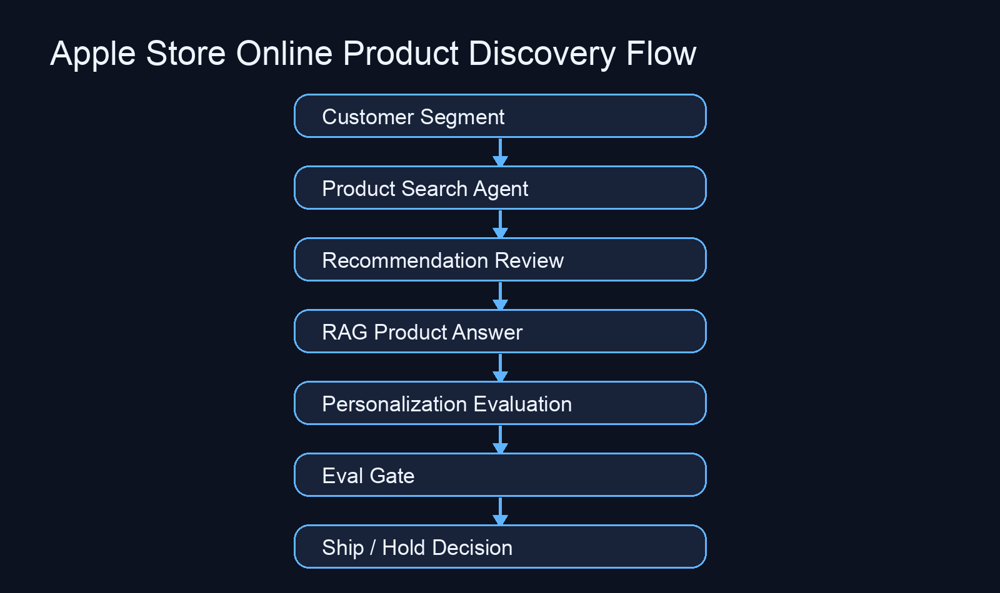

# Apple Store Online Product Discovery Demo

## Objective

Demonstrate a production-style personalization workflow for online product discovery.

This demo shows how AgentGrid maps customer-segment signals into evidence-based product recommendations, personalized messaging, evaluation checks, and release decisions.

## Visual Flow



## Workflow

```text
Customer Segment
→ Product Search
→ Recommendation Review
→ RAG-Based Product Answer
→ Personalization Evaluation
→ Eval Gate
→ Release Decision
